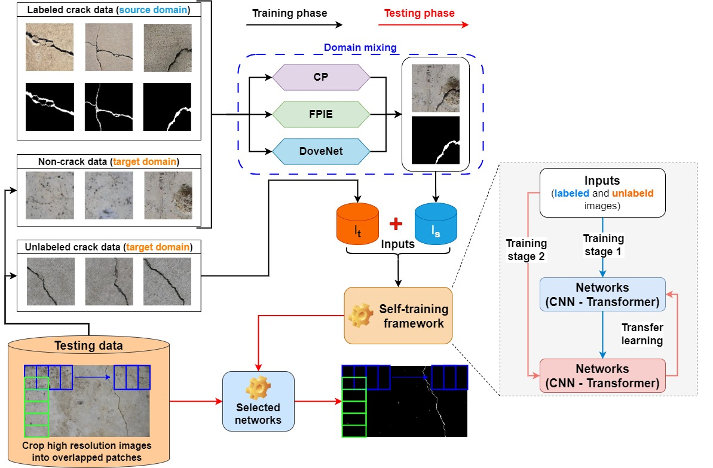
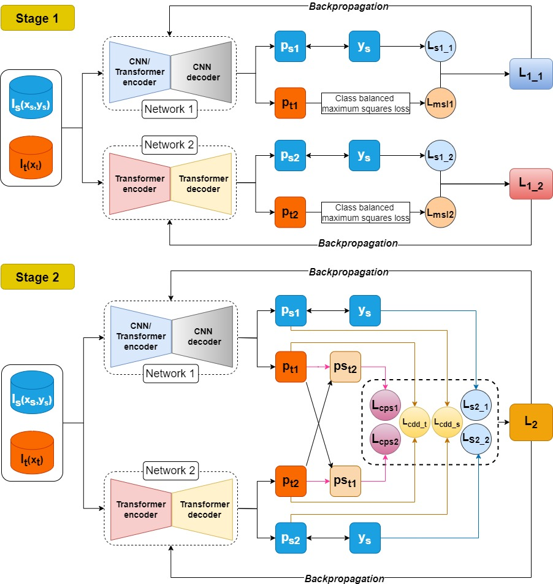

# STDASeg
This repository is dedicated to sharing the materials and code related to our ***under reviewed*** journal paper: "**A novel self-training approach for structural crack detection using image blendingbased domain mixing and mutual learning (Quang Du Nguyen, Huu-Tai Thai, and Son Dong Nguyen)**". In this paper, 
a self-training framework for domain adaptive crack segmentation (STDASeg) is proposed. STDASeg aims to enhance crack detection in civil infrastructure by leveraging image *blending-based techniques for domain mixing* and *CNN-Transformer mutual learning for self-training*, eliminating the need for extensive manual labeling. 

## Overall framework

### Visualization of the proposed self-training framework (C-TML).

## Structured data for training and testing
.
├── source_data				            : source concrete data for synthesizing new crack images
│   ├── crack_images
│   ├── crack_masks
│   └── crack_masks_dilated (dilated masks to avoid lost crack boundary when blending)
├── train_src_data.txt		        : list of source concrete images for synthesizing new data
├── Testset_169										: images and masks for testing
│   ├── crack_images
│   ├── crack_masks
├── test_fullsize.txt							: list of high-resolution images for testing
├── Trainset										  : images and masks and non-crack images for training, synthesizing
│   ├── crack_images
│   ├── crack_masks
│   ├── non-crack_images
├── train_crack.txt								: list of crack images for training from the target domain
├── train_noncrack.txt: list of target non-crack images for synthesizing new data
├── Validset										  : images and masks for validation
│   ├── crack_images
│   ├── crack_masks
├── val_data.txt									: list of cropped target images for validation

## Acknowledgment
STDASeg is based on following repos. We thanks for their great works: 
- [SSL4MIS](https://github.com/HiLab-git/SSL4MIS) 
- [MaxSquareLoss](https://github.com/ZJULearning/MaxSquareLoss) 
- [BCDM](https://github.com/BIT-DA/BCDM) 
- [DoveNet](https://github.com/bcmi/Image-Harmonization-Dataset-iHarmony4) 
- [FPIE](https://github.com/Trinkle23897/Fast-Poisson-Image-Editing) 
- [Segmentation Models Pytorch](https://github.com/qubvel-org/segmentation_models.pytorch) 

